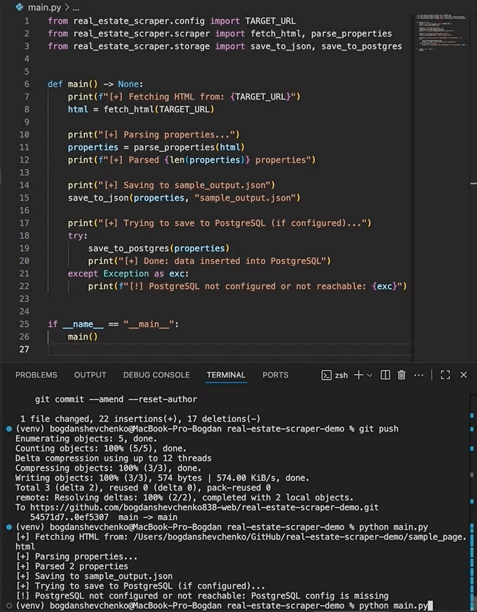

# Real Estate Scraper Demo

A clean, minimal demo project showing how to build a real-estate data extraction pipeline using Python.  
The goal of this repository is to demonstrate skills in:

- Web scraping (requests + BeautifulSoup)
- Data normalization into a unified schema
- JSON export
- Optional PostgreSQL integration
- Clean code structure suitable for production

The project uses a mock/example page structure, selectors can be easily replaced with real client websites.

---

## Tech Stack

- **Python 3.10+**
- **requests** — HTTP client  
- **BeautifulSoup4** — HTML parsing  
- **psycopg2** — PostgreSQL driver  
- **python-dotenv** — environment variable loader  

---

## 📁 Project Structure
```
real-estate-scraper-demo/
│
├── main.py
├── README.md
├── requirements.txt
├── .gitignore
│
└── real_estate_scraper/
├── init.py
├── config.py # Loads TARGET_URL and PostgreSQL credentials
├── models.py # Dataclass for Property
├── scraper.py # HTML downloader + property parser
├── storage.py # JSON + PostgreSQL storage
└── utils.py # Helpers (parsing numbers, floats, prices)
```
## 🧪 Mock HTML Page

This repository includes a small demo HTML page used for parsing development:

- File: [`sample_page.html`](./sample_page.html)
- Contains two `.property-card` blocks with title, price, address, beds/baths, area and link.
- The scraper in `scraper.py` is written to match this structure 1-to-1.

You can open it in a browser or modify it to simulate different layouts.

---

## 📂 Sample Output File

After running `python main.py`, the normalized data is written to:

- [`sample_output.json`](./sample_output.json)

It contains a list of `Property` records with fields:

- `title`
- `price_usd`
- `address`
- `beds`
- `baths`
- `area_sqft`
- `url`

## 🎥 Demo — Running the Scraper

This short demo illustrates the scraper running end-to-end:
it loads the mock HTML file, parses the property listings, and saves the normalized data into `sample_output.json`.

<p align="center">
  
</p>


---

## Quick Start

### 1. Create & activate virtual environment

```bash
python -m venv venv
source venv/bin/activate   # On Windows: venv\Scripts\activate
pip install -r requirements.txt
```

## 2. Run the scraper
```bash
python main.py

The script will:
- Download HTML from TARGET_URL (located in config.py)
- Parse property cards into a normalized Python dataclass
- Save results into sample_output.json
- Insert rows into PostgreSQL (if configured)
```

## 3. PostgreSQL Integration (optional)
```bash
To enable database saving, create a .env file in the project root:
PG_HOST=localhost
PG_PORT=5432
PG_DB=real_estate
PG_USER=postgres
PG_PASSWORD=postgres
If .env is missing, the script gracefully falls back to JSON-only mode.
```

## Example Output (JSON)

```json
[
  {
    "title": "Modern 2BR Apartment Downtown",
    "price_usd": 1200,
    "address": "123 Main St, Sample City",
    "beds": 2,
    "baths": 1.5,
    "area_sqft": 750,
    "url": "https://example.com/listing/123"
  }
]
```

## Notes
```
Selectors in scraper.py are placeholders meant to be adapted to real listings.
Useful as a starting point for real estate aggregation, rent-price analysis, or ETL pipelines.
The code is written to be clear, modular, and easy to extend.
```
---

## How to Adapt This Scraper to a Real Website

This project is intentionally structured so it can be quickly adapted to any real-world website.

### 1. Update HTML selectors

Open `scraper.py` and replace class names such as:

```python
".property-card"
".property-title"
".property-price"
".property-address"
".property-beds"
".property-baths"
".property-area"
with selectors that match the real website's structure
(e.g. .listing, .price-tag, .address-line).
```

## 2. Expand the data model (optional)

To capture additional fields:
- modify `Property` dataclass in `models.py`
- update parsing logic in `scraper.py`
- update database schema in `storage.py` (only if PostgreSQL is used)


## 3. Enable PostgreSQL storage (optional)

Create a `.env` file with:

```env
PG_HOST=localhost
PG_PORT=5432
PG_DB=real_estate
PG_USER=postgres
PG_PASSWORD=postgres
```
When present, the script automatically inserts parsed records into the database.

## 4. Replace the mock HTML with a real page

Set TARGET_URL in config.py to:

- a direct HTML file,
- a downloaded page,
- or a fetched URL (HTTP request).

Example:
```python
TARGET_URL = "https://somesite.com/rentals"
```
This structure makes the scraper suitable for:
- aggregators
- price monitoring tools
- real estate analytics dashboards
- ETL pipelines
- and general-purpose web automation tasks

